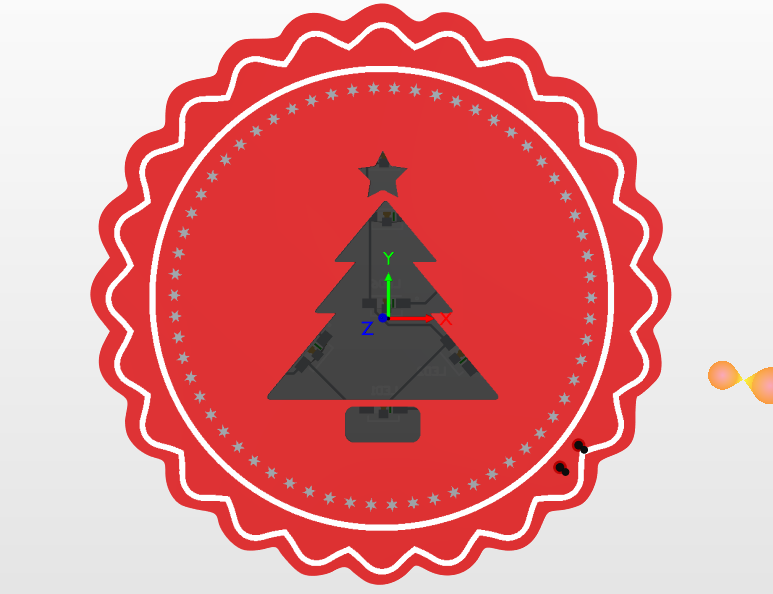

## ⭐ Julialabs PCB XMAS Badge 2021

Este projeto é uma placa de circuito impresso artística com o tema natalino desenvolvida usando o [Altium Designer](https://www.altium.com/altium-designer). Essa placa foi utilizada como premiação para o Julialabs PCB Challange de 2021.

## 📝 Esquemático

## ⚙️ Componentes necessários para o projeto (BOM LIST)
Kd Bom LIST 

## 🤝 Parcerias
Este projeto foi desenvolvido em parceria com:

## 📹 Vídeos relacionados
Veja alguns vídeos que produzi relacionados a este projeto:
- [Estou construindo um NOVO PROJETO de NATAL!](https://www.youtube.com/watch?v=-j7m6N0-H2w)
- [FIZ UMA PCB DE NATAL! Vem soldar comigo](https://www.youtube.com/watch?v=T3RpMhBZ_MQ)
- [PCB TRANSPARENTE COM ALTIUM DESIGNER - Como fazer](https://www.youtube.com/watch?v=8LfUdv58sRM)

